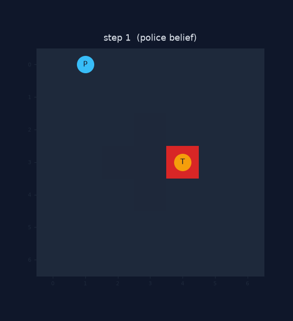
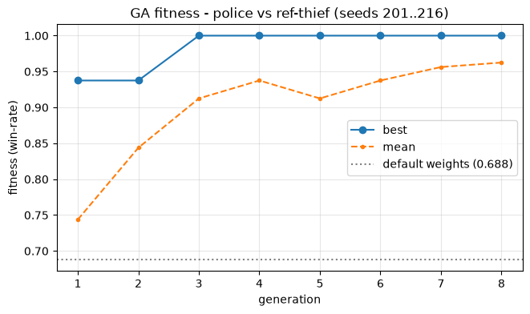
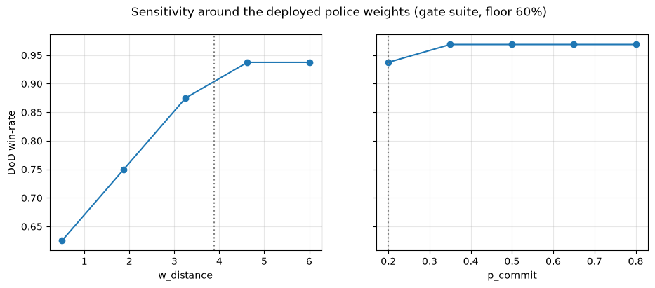
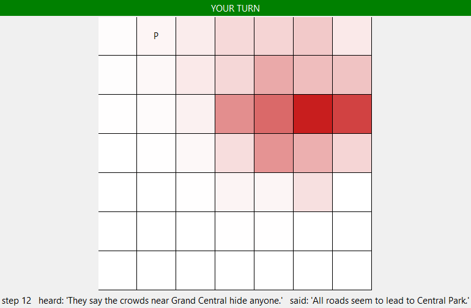
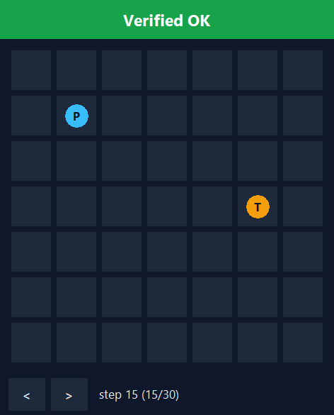
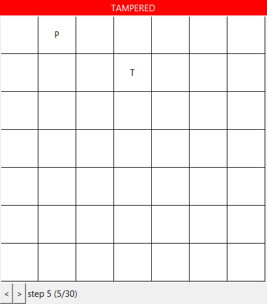
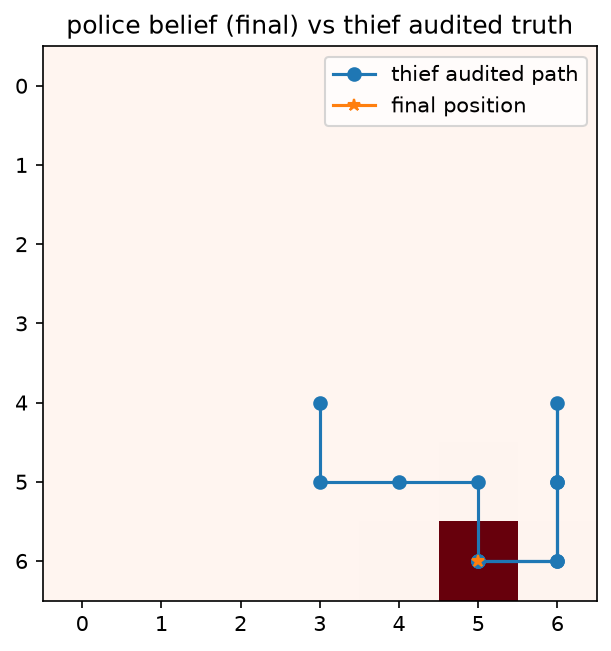
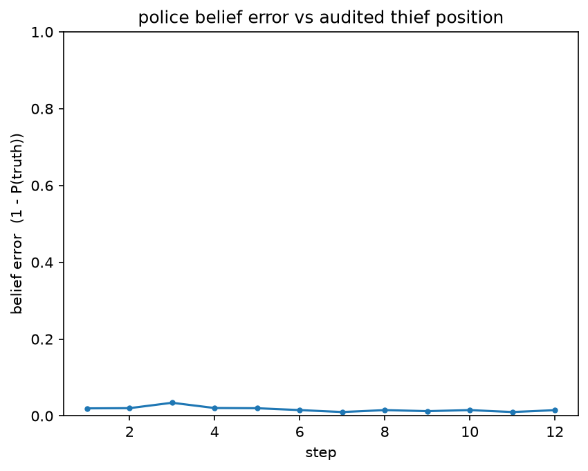
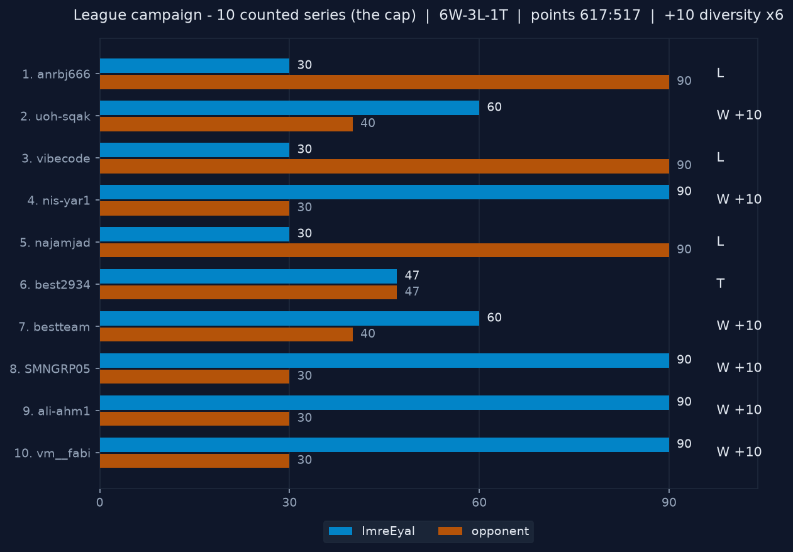
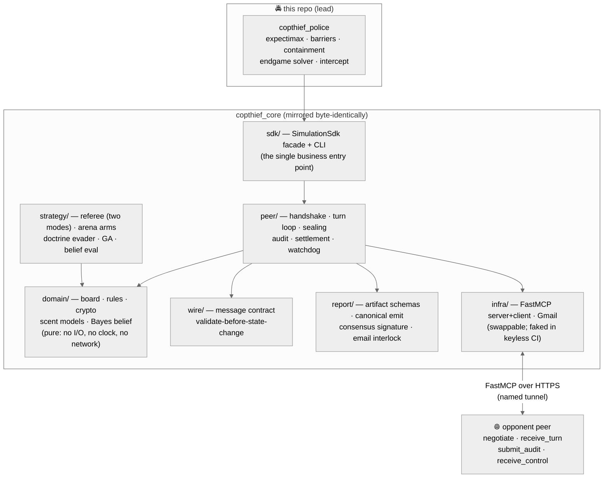

<div align="center">

# 🚔 copthief-p2p-cop

### The **cop agent** of a two-agent autonomous league system: hidden-position pursuit over P2P FastMCP, cryptographically audited, with no referee anywhere.

*Two symmetric agents — this **Cop** and its sibling **[Thief](https://github.com/Imreec/copthief-p2p-thief)** — play the official book's 7×7 scent-tracking race against other teams' agents over public MCP endpoints. Every move is committed before it is revealed, every game ends in a mutual byte-level audit, every series reports itself to the lecturer automatically. **This is the lead repo of the pair**: the shared engine is developed here and byte-mirrored to the thief. The strategy layer is the graded core — and it was rebuilt three times mid-league, from evidence, after real losses.*


</div>

---

> ### 📌 TL;DR — the headline result
> We played the **full league cap: 10 counted series against 10 distinct teams**, every one a first meeting, and finished **6W–3L–1T with 677 league points: 617 scored on the board plus the +10 first-meeting diversity bonus in each of our six wins** (517 conceded across the ten series). Every settled series ended with **both teams' independently-computed reports agreeing byte-for-byte** (`mutual_agreement.sha256` matched on every filing — ours *and* theirs), and every report was **emailed autonomously by the agent itself**, as the book's rules 32/35 demand. The strategy core earned it the hard way: after a 0–6 start-of-league loss the cop was rebuilt from forensic evidence **three times** (containment walling → belief-momentum interception → wire-true capture semantics), and after the last loss we **never lost again — four straight wins closing the campaign, and four 90–30 sweeps among the six wins** — including the fastest capture of the campaign, step 10, animated below from its committed audit log. Match-time LLM tokens across all ten series: **0, for both sides, sealed inside the commit-reveal payloads**.

<div align="center">



*A real counted game (ali-ahm1 series, sub-game 4), rendered from the committed audit log — the red cell is our **live belief** of the hidden thief; it is pinned on the true cell every single step while the cop crosses the board and lands the capture. Regenerate it yourself: `uv run python scripts/render_replay_gif.py --log docs/evidence/counted-ali-ahm1-2026-08-21/ali-ahm1-vs-imreeyal_g04.jsonl --out replay.gif`.*

</div>

---

## 🎯 The four metrics — the book's own success criteria, answered

The book is explicit that success is measured on **four metrics — "and not the beauty of a single algorithm"** (ch.11.4, table 4; App C): can the system coordinate with a peer it doesn't control, adapt when information is partial, stay honest when cheating would pay, and hold up under load and failure? Each one maps to a place in this repo where it is *proven*, not claimed:

| Metric (book ch.) | What the book asks | Where this system answers |
|---|---|---|
| **Coordination** (ch.2) | turn management and two-agent sync over P2P FastMCP, with no central referee | [Orchestration dilemmas](#%EF%B8%8F-orchestration-dilemmas--fastmcp-with-no-referee) — and the strongest possible live evidence: **ten different teams' codebases negotiated, played and settled cleanly against ours** |
| **Adaptation** (ch.4, 6) | a probabilistic belief over the rival, built from decaying scent + verbal hints | [the exact Bayes filter](#-the-dec-pomdp-model) — its most-likely cell IS the rival's true cell **97.7%** of the time (baseline: 5.7%; CI-pinned) — and [every strategy decision taken over it](#%EF%B8%8F-strategies--the-graded-core) |
| **Integrity** (ch.5) | cheat prevention via Commit-Reveal + SHA-256 and full mutual audit | [the commit-reveal rail](#-hidden-positions-provable-truth--commit-reveal--audit) — one flipped bit anywhere flips a game to TAMPERED, and **all ten counted series settled byte-identical on both sides** |
| **Architecture** (ch.8, 10) | Gatekeeper + Orchestrator patterns; code that survives load and failure | [the single-gateway loop, the gatekeeper chain, the watchdog](#%EF%B8%8F-orchestration-dilemmas--fastmcp-with-no-referee) and the [19-drill chaos battery](docs/evidence/m6-chaos.md) in keyless CI |

The book closes that table with the bar we aimed at: a team that answers yes on all four *"is not just running an agent — it is operating a system."*

---

## ✅ Deliverables — every requirement, one click to its proof

The book's mandatory README components (§9.4.2) and repository contents (§9.4.1 + App C), mapped to where they live. A **★** marks where we built past the floor.

| # | Required | Where it lives | Verify it |
|---|----------|----------------|-----------|
| 1 | **Dec-POMDP model** (§9.4.2-1) | [The Dec-POMDP model](#-the-dec-pomdp-model) | formalism table ↔ `domain/` types |
| 2 | **Orchestration dilemmas** (§9.4.2-2) | [Orchestration dilemmas](#%EF%B8%8F-orchestration-dilemmas--fastmcp-with-no-referee) | each dilemma cites the live incident that forced it |
| 3 ★ | **Strategies** (§9.4.2-3) — *"the graded core"* | [Strategies](#%EF%B8%8F-strategies--the-graded-core) | [ADRs 0011–0017](docs/adr/) · arena gates in CI |
| 4 ★ | **Learning curves** (§9.4.2-4) | [Learning curves](#-learning-curves--ga--self-play) | [`notebooks/results_analysis.ipynb`](notebooks/results_analysis.ipynb) (committed with outputs, renders-clean pin in CI) |
| 5 | **Screenshots** (§9.4.2-5, "absolute must") | [Screenshots](#-screenshots) | live GUI belief heatmap · Replay **Verified OK** |
| 6 | **Sibling-repo link** (§9.4.2-6) | [copthief-p2p-thief](https://github.com/Imreec/copthief-p2p-thief) | its README links back here |
| 7 | PRD / PLAN / TODO + per-mechanism PRDs (§9.4.1) | [`docs/`](docs/) | 10 PRDs, gate-approved before their code |
| 8 | `config/` committed (§9.4.1) | [`config/`](config/) | [Configuration guide](#%EF%B8%8F-configuration-guide) |
| 9 ★ | **League play** — ≥2 counted series vs distinct groups (App F) | **10 of 10** — [The league campaign](#-the-league-campaign) | [`reports/counted-series/`](reports/counted-series/) — one folder per opponent |
| 10 | Automatic reporting (App E rules 32/34/35) | [`report/`](src/copthief_core/report/), [ADR-0008](docs/adr/0008-email-posture.md) | all 10 filings auto-fired, artifact attached |
| 11 ★ | Byte-level interop | [The conformance kit](#-the-conformance-kit--a-deliverable-the-whole-league-used) — our public league standard | kit CORE vectors are CI-blocking fixtures ([`tests/conformance/`](tests/conformance/)) |
| 12 | Security (App A / rule 30) | [Security](#-security) | `gmail.send`-only token · secrets never tracked |
| 13 | Honest disclosure | [`KNOWN_LIMITATIONS.md`](KNOWN_LIMITATIONS.md) · [`SELF_GRADE.md`](SELF_GRADE.md) · [`COST.md`](COST.md) | [Known limitations](#%EF%B8%8F-known-limitations--self-grade) |
| 14 | User manual (guidelines §2.1) | [Installation](#-installation) · [Usage](#%EF%B8%8F-usage) · [Configuration](#%EF%B8%8F-configuration-guide) | run the commands |

> **Evidence tiers** (PLAN §12): keyless unit/property tests + kit CORE vectors (CI on every push) · full-series integration over in-process fakes (CI) · **committed live evidence** — oracle-spike logs, chaos-drill logs, cross-team friendlies, and the ten counted-series artifact sets. CI never touches a network, a key, or Gmail.

---

## 🎲 The game

*Distributed Cops-and-Robbers over a P2P Network* (book v3.0.0): a cop and a thief move on a **7×7 board**, one step at a time (N/S/E/W/STAY), for **35 thief-steps**. The cop may spend its move placing one of **14 barriers**; a capture — by landing, cornering (rule 46) or imprisonment (rule 47) — scores **20 to the cop and 5 to the thief**, while survival to the horizon scores **10 to the thief and 5 to the cop**. Six sub-games per series, roles alternating. The twist is *information*: **neither agent ever sees the other's position**. What crosses the wire is a **scent field** (a decaying 5×5 pheromone grid around the sender's true cell), a free-text **hint** (≤15 words, possibly a lie), and a cryptographic **commitment** to the sender's sealed state. Truth exists only at the end: a mutual **audit** reveals every nonce, and both engines re-derive the outcome from the reveals — *capture is derived, never declared*.

There is **no referee anywhere** — not in the league, and none in our architecture either at match time. Both agents are simply peers holding four MCP tools open to each other (`negotiate` / `receive_turn` / `submit_audit` / `receive_control`), racing under signed timeouts. The only binding source of quantitative values is the book's **App F parameters table**; our signed constitution [`config/game.json`](config/game.json) instantiates it, and a loader-level **App F guard** refuses any pairing agreement that alters a fixed value or lowers a minimum.

---

## 🧮 The Dec-POMDP model

The race is a two-agent **decentralized partially-observable Markov decision process** ⟨*n, S, {Aᵢ}, P, R, {Ωᵢ}, O*⟩, and the implementation maps onto the tuple one-to-one:

| Symbol | Meaning | In this system |
|--------|---------|----------------|
| **n** | agents | 2 — cop and thief, symmetric peers ([`peer/`](src/copthief_core/peer/)). |
| **S** | state | `(cop_cell, thief_cell, barriers, step)` on the signed 7×7 board — **never held by anyone at match time**; it exists complete only in the post-audit reconstruction and in the referee used for offline evaluation ([`strategy/referee.py`](src/copthief_core/strategy/referee.py)). |
| **Aᵢ** | actions | move ∈ {N,S,E,W,STAY}; the cop's move may instead place a barrier (quota 14, impassable to both); plus the verbal action — a hint of ≤15 words ([`domain/gazetteer.py`](src/copthief_core/domain/gazetteer.py)). |
| **P** | transition | deterministic; illegal moves are refused by validation before any state change ([`wire/validation.py`](src/copthief_core/wire/validation.py)). |
| **R** | reward | capture/cornering/imprisonment → cop 20, thief 5; survival to step 35 → thief 10, cop 5; series tie adds `tie_score` 2 to both ([`domain/scoring.py`](src/copthief_core/domain/scoring.py)). |
| **Ωᵢ** | observations | own cell + the opponent's **scent frame** (physics-checkable but unauthenticated), **hint** (adversarial — possibly a lie), **capture-claims** (truth-dutied), and the opponent's **commitments** (binding, unreadable until audit). |
| **O** | observation fn | realized by the pair-locked scent model + commit-reveal: the scent field is emitted from the true cell, so it *is* `O(s)` — noisy in age, exact in physics — while the commitment stream makes the whole observation history tamper-evident after the fact. |

Uncertainty is handled head-on: over Ωᵢ the agent maintains an **exact Bayesian belief** P(opponent at cell) ([`domain/belief.py`](src/copthief_core/domain/belief.py)) — motion diffusion × scent likelihood × hint evidence × claim collapse — and *every* strategy decision is taken over that distribution, never over a point estimate. The filter's edge over a baseline that uses only protocol-certain facts is CI-pinned: under the fielded scent model, **the filter's most-likely cell is the opponent's true cell 97.7% of the time, against 5.7% for the baseline** — winning on all 10 evaluation seeds ([`docs/evidence/m3-belief-eval.md`](docs/evidence/m3-belief-eval.md)).

One modelling subtlety the book leaves self-contradictory — whether each step's reveal is immediate (making Ωᵢ near-complete) or deferred — we resolved as **`reference-v3`: reveals are deferred to the audit boundary**, keeping positions genuinely hidden through the game. The full argument, and the registered alternative shape, are in [ADR-0010](docs/adr/0010-wire-shape.md) and the [contradiction table](#-where-the-book-contradicts-itself--the-choices-we-made) below.

---

## ⚙️ Orchestration dilemmas — FastMCP with no referee

The book asks for a discussion of the real orchestration dilemmas (§9.4.2-2). Ours are not hypothetical — each one below names the live incident that forced it, because nearly every mechanism in [`peer/`](src/copthief_core/peer/) exists as a scar from a real cross-team game.

**Who moves, and what is "a turn"?** Two symmetric peers with no coordinator must agree at every instant whose step it is. We run a strict state machine ([`domain/state_machine.py`](src/copthief_core/domain/state_machine.py)) — an illegal transition *raises*, never limps — and the peer loop tolerates exactly the inbound disorder reality produces: duplicated pushes are absorbed by commit-keyed dedup ([`peer/inbox_order.py`](src/copthief_core/peer/inbox_order.py)), a stale echo from an earlier sub-game claiming *our own role* is tolerated without renewing any deadline (a guard born from a live incident), while a genuinely wrong step from the right role stays fatal. That distinction — *absorb noise, refuse corruption* — is the whole discipline in one sentence.

**Deadlines are a two-sided contract.** The signed constitution gives each side `response_timeout_sec = 30`. Our hardest league bug (diagnosed *by an opponent* from wire timestamps, twice): our client bounded the tool call but **not the MCP session teardown**, so a 95 ms push followed by a ~61 s hanging close put our next turn outside their window — two sub-games died before we wrapped **the whole exchange, teardown included,** in one deadline (`asyncio.wait_for` around call *and* close; [`infra/mcp_client.py`](src/copthief_core/infra/mcp_client.py)). The standing rule it taught us: **every outbound call carries an explicit deadline, and the deadline covers everything the call can possibly block on.**

**The Orchestrator is the single gateway; the Gatekeeper prices every external call.** All match flow goes through one loop ([`peer/session.py`](src/copthief_core/peer/session.py) behind the [`sdk/`](src/copthief_core/sdk/) facade) — no side channel can advance state. Every outbound email passes the **Gatekeeper** ([`shared/gatekeeper.py`](src/copthief_core/shared/gatekeeper.py)): quota → token bucket → circuit breaker, with operational limits loader-asserted to be at least the signed minimums, and a daily send cap as the book's rule-28 runaway protection. A **watchdog** measures *loop liveness* (not I/O!) and dies loudly with a persisted snapshot — its own lesson from a kill-drill where an I/O-measuring watchdog would have shot a healthy game.

**Failure must not be contagious.** Chaos engineering is a permanent CI battery: **19 drills** — dead peer, deadline-edge delay, malformed messages, replayed turns, tampered audit records, fabricated scent grids, redelivery storms, mid-push tunnel death — each asserting its *specific* defense fires ([`docs/evidence/m6-chaos.md`](docs/evidence/m6-chaos.md)). The two live kill-drills over a real Cloudflare edge are committed too, including the honest one: an agent that loses its edge for 3 minutes **loses by rule, not by suicide** — it stays alive to the last budgeted second, then concedes by protocol.

**Identity, sequencing, refusal.** Every sub-game opens with a `negotiate` handshake that seals the sub-game number, role, declared commit, scent-model hash and counted-game count — so the two-channel identity (plaintext declaration vs sealed record) **agrees by construction**. A stranger naming a different group is refused *without consuming the window*; a refusal always **names the missing construction** rather than just disagreeing; and *omission never refuses* — unknown fields are tolerated, missing required ones are not. These three rules are what let ten different teams' codebases, none of which had ever met ours, negotiate and settle cleanly.

**Verbal channel ≠ authority.** The opponent's hint text is adversarial input. It reaches a closed-vocabulary gazetteer parser, feeds the belief as *discounted* evidence, and can never reach anything with authority — there is no LLM in the match path at all (`llm_model = "none"`, declared at step 0 and sealed; App E rule 25 is enforced by an AST-scan test). An injection corpus is part of CI.

---

## 🔐 Hidden positions, provable truth — commit-reveal + audit

Partial observability with no referee only works if nobody can lie about the past. Every turn carries `SHA256(canonical_state | nonce)` — binding position, intent and token count *before* the move is seen ([`domain/crypto.py`](src/copthief_core/domain/crypto.py), byte-forms pinned by our [conformance kit](https://github.com/Imreec/copthief-league-protocol)). Nonces are withheld until the **audit**: at game end both sides exchange full record sets, re-hash every commitment, and re-derive the outcome. One flipped bit anywhere — a position, a token count, an intent — flips the game to **TAMPERED** (rule 19's "no almost-match"; the mutation matrix is CI-pinned). The replay verifier ([`copthief replay`](src/copthief_core/peer/replay.py)) does the same offline for any committed log, which is why every figure in this README regenerates from evidence a grader can re-hash.

The same rail carries fairness: the **step-0 declaration** seals our git commit, hardware spec, model (`none`) and token counts *inside* the commit-reveal stream, making the [0-token claim](#-cost) tamper-evident rather than merely asserted. And in-play, inbound scent frames are **physics-checked** — re-walked against the pair-locked model — with refusals recorded as evidence, never as unilateral verdicts (the audit stays the only judge; our check found a real physics bug in one opponent's scent, cited in their same-evening fix).

---

## ♟️ Strategies — the graded core

The book inverts HW6: *strategy is the score* — App F §5 names the strategy module "the grading core". Our strategy story is the league story — every brain below was built or rebuilt in response to measured evidence, gated by a champion-regression arena before it could ship, and validated live. Decisions live in [ADR-0005](docs/adr/0005-strategy-track.md) and [ADRs 0011–0017](docs/adr/); no RL and no LLM sit anywhere in the decision path — deterministic search + engineered features over the exact belief, with **offline GA tuning of config-owned weights**.

### The cop (this repo, [`src/copthief_police/`](src/copthief_police/))

| Mechanism | What it does | Measured effect |
|---|---|---|
| **Expectimax over the belief** ([`search.py`](src/copthief_police/search.py)) | position uncertainty as a chance node; features (distance, mobility, region, budget) GA-tuned | the base brain: wins **30 of 32** arena games vs the reference thief (required floor: 60%, CI-blocking) |
| **Barrier graph-surgery** ([`barriers.py`](src/copthief_police/barriers.py)) | spends the 14-wall quota on belief-weighted region cuts | the cage conversions (rule 46/47 forms) in the uoh-sqak, bestteam and SMNGRP05 series are its work; landed claims (the step-10 capture above) are the interception era's complement |
| **Containment walling** ([`containment.py`](src/copthief_police/containment.py), ADR-0012) | sub-threshold walls as *tempo investment* when the center is structurally uncuttable | the vibecode 0–6 lesson: captures vs their ring-runner class went **3 of 32 → 32 of 32** |
| **Forcing endgame solver** ([`endgame.py`](src/copthief_police/endgame.py), ADR-0011) | exact iterative-deepening proof search once the belief is sharp; node-budget, no wall-clock | 3,125 calls across the opponent pool, **zero budget-aborts** at the shipped cap ([evidence](docs/evidence/m11p2-solver-defer.md)) |
| **Belief-momentum intercept** ([`intercept.py`](src/copthief_police/intercept.py), ADR-0015) | hunts where the thief *will* be, from the belief's motion trend | the best2934 lesson: captures vs our own hardest evader went **4 → 10 of 32** |
| **Reply-adjacency positioning** ([`reply_forecast.py`](src/copthief_police/reply_forecast.py), ADR-0017) | maximizes adjacency over the opponent's reply distribution | shipped default-off after an honest sweep: **+12 wins of 32** on one opponent class but **−8** on another — kept as a per-pairing option, not a default |
| **Claim discipline** (ADR-0016) | a capture is announced only when the belief puts **≥10%** on the landing cell — a quiet cop leaks nothing to claim-reading opponents | a claim-reading opponent's ability to track our cop falls from **0.94 to 0.43**; +24% points against that class |

### Learning the league from its logs

Every game we played — friendly or counted, won or lost — became training data. The audit rail hands both sides a complete, tamper-evident record of every match, and we mined ours systematically: each rival's play style was **rebuilt as an arena arm from the game tapes our own pairings produced** (supplemented by code where a team published theirs), and an arm earned trust only by *reproducing the very logs it was learned from* — a CI-pinned fidelity floor, with any arm below 90% agreement labeled *directional* and weighted accordingly. Our config knobs were then re-measured against that modeled league before anything shipped ([`docs/evidence/m9-study-arena.md`](docs/evidence/m9-study-arena.md) and the m10–m13 studies beside it). The three counted losses were this loop's most valuable inputs: the M13 log forensics caught our own arena grading a capture rule the wire does not grade — we re-based the referee to **wire-true capture semantics** (ADR-0016), re-measured everything, and the campaign closed with four straight wins, three of them 90–30 sweeps.

### The evader (fielded by the sibling, built in the shared core)

The **doctrine evader** ([`strategy/doctrine_evader.py`](src/copthief_core/strategy/doctrine_evader.py), ADRs 0011–0015) scores its moves safety-first, in strict priority order: a **lethal gate** (assume the worst wall the cop could reach from the belief's most likely positions — never step where that wall kills), an anti-camping cap, flight only when genuinely hunted, then **room-preserving terms** driven by a four-walls-ahead forecast (whose depth knob, once fixed from a live bug, took survivals vs the hardest wall-building cop from **16 of 32 to 31 of 32**). Live counted record: **every thief window of the last four series survived the full horizon (12 of 12)** — and 19 consecutive survivals against bestteam's cop across that pairing's history. Its full numbers live in the [sibling README](https://github.com/Imreec/copthief-p2p-thief).

### The gate that kept us honest

No brain ships on a story: [`tests/integration/test_arena_harness.py`](tests/integration/test_arena_harness.py) replays a seeded round-robin over the full pool of opponent models and **fails CI if the champion loses to its predecessor**; [`test_arena_dod.py`](tests/integration/test_arena_dod.py) pins the minimum win-rates. Two candidate "improvements" were measured, found regressive on real opponent models, and **refused by the gate** — both recorded as honest negatives ([the self-play cop harvest](docs/evidence/m11p2-selfplay.md), [the claim-policy retune](docs/evidence/m7-20-ga-under-the-claim-policy.md)).

---

## 📈 Learning curves — GA + self-play

Reinforcement learning is optional in the book (§9.4.2-4 asks for curves *if* an agent was trained); we chose **evolution over temporal-difference** — the policy is a small, smooth weight vector, exactly a GA's regime — and trained offline only, deploying weights as config. The committed curves regenerate from committed config alone ([`notebooks/results_analysis.ipynb`](notebooks/results_analysis.ipynb), executed in CI):

<p align="center">
  
  
</p>

- **The genetic tuning:** fitness (win-rate as cop vs the reference thief, on fresh seeds) climbs **0.688 with default weights → 1.000** in three generations. Validated *off* the training suite: win-rate on the CI gate suite rose **75% → 94%**, and on a completely fresh holdout **78% → 97%**. The right plot is the honesty check on the result — which genes are load-bearing (cliffs) and which are forgiving (plateaus).
- **Self-play (ADR-0014):** an alternating best-response loop guarded by a *real-opponent pool gate* — a harvested brain ships only if it holds or improves against **every** modeled opponent. The evader harvest passed and shipped (survival vs our own best cop went **3 of 32 → 18 of 32**, and one modeled rival's matchup closed from 22 of 32 to a clean 32 of 32); the cop harvest scored higher fitness but was **refused twice** for regressions against real opponent models; the loop stopped honestly at its plateau.

---

## 📸 Screenshots

The book marks these as an absolute must, and explains why (App C): the belief map is *proof the agent actually performs probabilistic inference under partial observability*, and the Verified OK banner is *proof the cryptographic move chain was checked and held* — trust established without any central referee. Both follow.

**Live GUI — the belief heatmap** (App E rules 8–9: local truth only; the view renders *our belief*, never the objective board):

<p align="center">
  
</p>

**Replay verifier — Verified OK vs TAMPERED** (the same committed log, before and after flipping one byte):

<p align="center">
  
  &nbsp;
  
</p>

**Belief vs audited truth** — from the tenth counted series (vm__fabi g02, capture step 11): the final belief mass sits exactly on the audited capture cell; the error curve for the whole game is beside it.

<p align="center">
  
  
</p>

*(Regenerate from the committed log: `uv run copthief overlay --log docs/evidence/counted-vm__fabi-2026-08-23/imreeyal-vs-vm__fabi_g02.jsonl --out overlay.png --role police`. The animated capture at the top of this README is the same idea in motion.)*

---

## 🏆 The league campaign

<p align="center">
  
</p>

| # | Opponent | Result | Score | Sub-games | Diversity |
|---|----------|--------|-------|-----------|-----------|
| 1 | anrbj666 | **L** | 30–90 | 0–6 | — |
| 2 | uoh-sqak | **W** | 60–40 | 4–2 | **+10** |
| 3 | vibecode | **L** | 30–90 | 0–6 | — |
| 4 | nis-yar1 | **W** | 90–30 | 6–0 | **+10** |
| 5 | najamjad | **L** | 30–90 | 0–6 | — |
| 6 | best2934 | **T** | 47–47 | 3–3 | — |
| 7 | bestteam | **W** | 60–40 | 4–2 | **+10** |
| 8 | SMNGRP05 | **W** | 90–30 | 6–0 | **+10** |
| 9 | ali-ahm1 | **W** | 90–30 | 6–0 | **+10** |
| 10 | vm__fabi | **W** | 90–30 | 6–0 | **+10** |

Ten series, ten distinct teams, ten first meetings. On the board: **617 points scored, 517 conceded**; adding the **+10 first-meeting diversity bonus earned in each of our six wins**, our league tally is **677**. Every counted artifact set (declaration, six per-game configs, six logs, six Hebrew reports, final result) is committed under [`reports/counted-series/`](reports/counted-series/) — **one folder per opponent** — with six series' full wire logs under [`docs/evidence/`](docs/evidence/). `tokens_total_series` is **0 for both sides in all ten filings**.

Three things this table doesn't show:

- **The settlement record.** All ten series settled with `mutual_agreement.confirmed: true` and matching SHA-256 on both teams' independently-generated reports — cross-diffed against the opponent's actual lecturer filing wherever they shared it. Under rule 35 (a missing *or contradictory* report zeroes both teams) this byte-lockstep is the difference between a season and a disaster.
- **The arc.** The opening loss (anrbj666) predates most of the strategy program; the setbacks after it were each diagnosed to a *specific* mechanism from the committed logs — a parity-locked follow-the-leader cop (the vibecode loss), a scent-blind belief with every inbound frame failing physics (the najamjad loss), a claim gate reading the wrong statistic at co-location (the best2934 tie). Each got its ADR, its counter-mechanism, and its regenerated instruments; after the final rebuild the record is **4–0, three of them 90–30 sweeps**.
- **The pairing work.** Around the counted games sit the friendlies: format-proving series against ourselves and each opponent (reports to the two teams only — *never* the lecturer, until a counted run) that killed 10+ interop defects per pairing before anything was at stake. Two of our physics/paperwork checks are cited in opponents' own bug-fix commits.

---

## 📖 Where the book contradicts itself — the choices we made

The book grants academic freedom where it contradicts itself or its reference implementation: *choose and document*. Our full record (each with its ADR/PRD citation):

| Contradiction | Our choice |
|---|---|
| **Scent decay**: multiplicative (book ch.4 prose) vs subtractive (reference code) | Both, as **named pair-locked models** (`subtractive_chebyshev_v1` default, `multiplicative_book_v1`), hash-declared at negotiate, sealed at step 0; refuse only when both peers declare *different* hashes ([ADR-0004](docs/adr/0004-scent-model-form.md)) |
| **Three commit constructions** across ch.5 / audit snippet / reference code | The **reference form** `SHA256(canonical \| nonce)` — the only one binding state *and* intent, and what the lecturer's tooling runs; a `divergent_forms` kit fixture keeps the wrong forms diagnosable ([PRD_crypto](docs/PRD_crypto.md)) |
| **Consensus signature** is a *third* canonicalization (spaced separators, sign-then-insert) | Implemented verbatim beside the compact form under **distinct helper names** so neither can silently substitute for the other ([PRD_reporting](docs/PRD_reporting.md); found by our partner team, credited) |
| **Wire shape / Ωᵢ self-contradiction**: per-step reveal vs the book's own hidden-position formalism | `reference-v3` — reveals **deferred to the audit boundary**; `bookletter-v3` registered as a sign-off-only deviation ([ADR-0010](docs/adr/0010-wire-shape.md)) |
| **Report language**: Hebrew-keyed report (book §8) vs the reference emailing its English artifact | Mirror the reference on the wire (emailed bytes = artifact bytes on disk); the Hebrew report is still written beside it — the book satisfied *on disk* ([PRD_reporting](docs/PRD_reporting.md)) |
| **Email posture**: draft/compose (App B) vs mandatory automatic reporting (rules 32/35) | Automatic send; authorization = the *configured recipient*, not an arming step; OAuth narrowed to `gmail.send` only ([ADR-0008](docs/adr/0008-email-posture.md)) |
| Book's exact 5×5 kernel almost-fits a radial Gaussian | Rejected the fitted reading (the rounding windows are provably disjoint); the **25 printed values pinned verbatim** ([ADR-0004](docs/adr/0004-scent-model-form.md)) |

---

## 📐 The conformance kit — a deliverable the whole league used

Those contradictions are exactly why we built **[copthief-league-protocol](https://github.com/Imreec/copthief-league-protocol)** — a public, stdlib-only conformance kit for the book's byte-level constructions, published for the whole course. It pins every hash-bearing form (canonical JSON, commit construction, terms signature, `game_uid`, the scent models, the consensus-signature variant) as **executable vectors verified against the reference implementation byte-for-byte**, ships negative vectors so a failure diagnoses itself to a *specific* wrong form, and includes a local **sparring peer** any team can dial to test a full pairing — handshake to audit — before ever risking a real one.

It did not stay ours. Over the season the kit became **the league's shared reference for interop**: the majority of the teams we faced ran its vector suites or its sparring peer before our series, coordinated pairings through its issue tracker, and filed findings there — several of which we accepted and credited by name, while kit runs on *their* side caught and fixed real defects in their agents before a counted game could be burned on them (a home-grown `game_uid` derivation and a token-accounting slip, among others). That is a large part of why ten cross-team series produced **ten byte-identical settlements and zero interop disqualifications**: by the time two agents met on the wire, they had already agreed on every byte that mattered. The kit is versioned against the book (v3.0.0), its CI regenerates and re-verifies every fixture on each push, and its pre-book design history is preserved at tag `v0.3-draft`.

---

## 📮 Reporting & the safety rails

Reporting is **automatic by design** — App E rule 32 mandates it, and rule 35 zeroes *both* teams when one side fails to report, so a human gate would put the opponent's score at risk too ([ADR-0008](docs/adr/0008-email-posture.md)). What is gated is the *address*:

- **The recipient is the authorization.** The resting state is `enabled = false` with an **empty recipient list** — the interlock ([`report/email_interlock.py`](src/copthief_core/report/email_interlock.py)) is a pure total function that refuses before any transport when no recipient was configured for the run.
- **The lecturer is structurally unreachable outside a counted series.** `RunMode` ([ADR-0009](docs/adr/0009-rehearsal-mode.md)) cannot even *construct* `counted_series` without the full App F rulebook armed; the interlock refuses his address whenever the run is not counted. Safety by shape, not by configuration.
- **Emailed bytes are the artifact bytes** — the body is the result file read back from disk, the artifact rides attached (rule 34), and the gatekeeper's quota → bucket → breaker chain plus a daily cap is the rule-28 runaway protection.
- A series is **never reported partially**: the runner refuses to settle an incomplete window, and the completeness guard was live-tested the hard way (a two-of-six early-send defect was caught in a friendly, fixed, and pinned).

## 🔒 Security

- **Send-only OAuth.** The Gmail token carries `gmail.send` *alone* — no read, no drafts (App E rule 30; we verified the narrowing empirically: profile reads 403). Sender identity is a dedicated team account; `client_secret*/token*` are git-ignored, `.env-example` is committed, and CI proves the tree keyless by running in it.
- **Hostile-input posture.** The opponent's hints are adversarial: closed-vocabulary parsing, injection corpus in CI, no LLM anywhere for them to prompt. Inbound messages are validated before any state change; unknown fields tolerated, missing required fields refused.
- **Crypto hygiene.** Nonces from `secrets`, withheld until audit; commitments bind identity, position, intent and token counts; per-game configs and the sealed step-0 declaration pin the exact commit hash each game was played from.
- **No quantitative value lives in code** — everything comes from the signed constitution, the private TOML, or the rate-limits file, scanner-enforced ([`scripts/check_no_hardcoded.py`](scripts/check_no_hardcoded.py)).

---

## 🏗️ Architecture

Two repos, one shared core, strict layers. This repo is the **lead**: [`src/copthief_core/`](src/copthief_core/) is developed here and mirrored **byte-identically** to the thief repo by [`scripts/sync_core.py`](scripts/sync_core.py) — a committed SHA-256 manifest is CI-verified in *both* repos, so the two agents can never drift apart silently ([ADR-0001](docs/adr/0001-sync-mirror-topology.md)). The role packages ([`copthief_police/`](src/copthief_police/) here, `copthief_thief/` there) are the only unshared code.



The load-bearing rules: **domain is pure** (every game fact is a deterministic function — this is what makes replay verification possible); **everything is consumed through the sdk facade**; **one rules module, two modes** (a full-information referee for tests/arena/tuning, the hidden-position peer for live play — no duplicated rules); **infra is swappable** (keyless CI runs the entire series flow over an in-process MCP fake). Deployment is a Cloudflare **named tunnel** (`cop.imreeyal.com` / `thief.imreeyal.com`, [ADR-0006](docs/adr/0006-deploy-tunnel.md)) — including the MCP DNS-rebinding 421 fix at the tunnel layer, which we documented for the league in the kit.

---

## 📦 Installation

Requirements: **Python 3.12+**, [`uv`](https://docs.astral.sh/uv/) (the only supported package manager), git. Windows/Linux/macOS.

```bash
git clone https://github.com/Imreec/copthief-p2p-cop
cd copthief-p2p-cop
uv sync                    # dev + viz + notebook groups; keyless
make grade                 # every quality gate, same as CI -> "ALL GATES GREEN"
```

Everything above runs with **no key, no network, no GPU**. Only live league play needs more:

```bash
uv sync --group email-live                     # Gmail SDK (operator machines only)
cp .env-example .env                           # points at the OAuth client + token paths
uv run --group email-live python scripts/gmail_auth.py   # one-time send-only consent
```

Troubleshooting: a `ConfigVersionError` at startup means a config file's `version` doesn't match the code's expectation — diff your `config/` against the committed one. A refused startup naming a signed value means the App F guard is doing its job — fix the config, not the guard. Gmail OAuth tokens in Testing mode expire after 7 days; re-run the consent script before a counted series.

## ▶️ Usage

The single console entry is `copthief` — every flow prints exactly one JSON result object.

```bash
# a full local mini-game, both peers in-process, with the live GUI
uv run copthief run local-match --gui --log logs/local.jsonl

# the same, but two real processes over localhost FastMCP HTTP
uv run copthief run p2p-match --police-seed 11 --thief-seed 22

# one standalone live peer (this repo plays police), dialing the opponent
uv run copthief run peer --role police --port 8802 \
    --opponent-url https://their-host/mcp --sub-game 1 --opponent-group theirteam

# a WHOLE live series: plays all six sub-games, then auto-sends its ONE report
uv run copthief series --role police --opponent-group theirteam --counted

# re-verify any committed log -> "Verified OK" / "TAMPERED" (exit 0/1)
uv run copthief replay --log docs/evidence/counted-vm__fabi-2026-08-23/imreeyal-vs-vm__fabi_g02.jsonl

# belief-vs-truth PNGs from any audited log
uv run copthief overlay --log <audited.jsonl> --out overlay.png --role police
```

**Governance flags** (mutually exclusive): `--rehearsal` arms the full App F rulebook with the lecturer *structurally unreachable*; `--counted` is the only mode from which the lecturer may be a recipient. With neither, you get a dev run with nothing armed. The analysis instruments live in [`scripts/`](scripts/) (`arena_run.py`, `ga_run.py`, `selfplay_loop.py`, `render_league_chart.py`, `render_replay_gif.py`, …), each self-documenting.

## 🎛️ Configuration guide

| File | Role | Notes |
|---|---|---|
| [`config/game.json`](config/game.json) | the **signed constitution** — board, scoring, scent, timeouts, league rules | byte-identical with the opponent per pairing; the App F guard refuses any edit that alters a fixed value or lowers a minimum |
| [`config/game.toml`](config/game.toml) | **private choices** — identity, ports, opponent URL, `[strategy.*]` weights, `[belief]`, `[scent]`, `[email]` | never crosses the wire; versioned (`ConfigVersionError` on mismatch); per-role weight tables + per-scent-model overlays |
| [`config/rate_limits.json`](config/rate_limits.json) | operational limits | loader-asserted ≥ the signed gatekeeper minimums |
| [`config/locked_models.json`](config/locked_models.json) | the named scent-model registry | copied verbatim from the kit — `sha256(canonical_json(doc))` is what crosses the wire at negotiate |
| `config/arena*.json`, `config/ga*.json` | the strategy instruments | every arena/GA result in `docs/evidence/` regenerates from these |

Per-game configs are committed as `config_<game_id>_g<NN>.json` beside each series' artifacts, so any game can be re-run at its exact signed terms.

---

## 🛠️ Engineering & reproducibility envelope

The book's submission criterion judges the *whole project* — code, structure, process — against the course's software guidelines, so this section is where that rubric is answered, each claim backed by a gate that enforces it:

| | |
|---|---|
| **Every file ≤ 150 source lines** | CI-enforced across src, tests *and* scripts — split, never compress. 165 modules under `src/`. |
| **Strict typing** | `mypy --strict` on `src/`: 0 errors; type hints on 100% of public APIs; docstrings on all public code (Input/Output/Raises style). |
| **1156 keyless tests, 96% coverage** | unit / integration / role / chaos / conformance; coverage gate ≥85% (fail-under in CI), deterministic core ≥90%. |
| **Kit CORE vectors as CI fixtures** | any change touching wire bytes, canonicalization or hashing re-verifies against the [conformance kit](https://github.com/Imreec/copthief-league-protocol) before merge. |
| **Core-mirror integrity** | the SHA-256 sync manifest is verified in both repos' CI; core edits happen only here. |
| **16 ADRs** | Context/Decision/Status/Consequences for every load-bearing choice — [`docs/adr/`](docs/adr/). |
| **Cross-model review** | a different model family (Antigravity) reviews every PR; findings accepted/rejected with reasons on the thread ([`docs/REVIEW_PROCESS.md`](docs/REVIEW_PROCESS.md)). |
| **Process** | Conventional Commits · branch → PR → review → squash · never push `main` · TDD (RED→GREEN→REFACTOR) · per-PR prompt log ([`docs/PROMPTS.md`](docs/PROMPTS.md)). |

CI runs two parallel lanes on every PR and push: a fast **gates** lane (lint, format, types, file sizes, scanners, mirror check, kit vectors, submission checklist) and the **test suite with coverage**. The heavy strategy-measurement evals (the champion-gate arena, the win-rate floors, the GA smoke run) ran CI-blocking throughout the league season; with the strategy frozen post-league they run on demand — see [`.github/workflows/`](.github/workflows/).

**Reproduce everything, keylessly.** The entire quality gate — and every number and figure in this README — rebuilds from the committed tree with no key, no network, no GPU:

```bash
make grade                                            # the full CI gate locally -> "ALL GATES GREEN"
uv run copthief replay --log docs/evidence/counted-ali-ahm1-2026-08-21/ali-ahm1-vs-imreeyal_g04.jsonl   # any counted log -> Verified OK
uv run python scripts/render_league_chart.py          # the campaign chart, from the ten banked artifacts
uv run python scripts/render_replay_gif.py --log docs/evidence/counted-ali-ahm1-2026-08-21/ali-ahm1-vs-imreeyal_g04.jsonl --out replay.gif
uv run python scripts/export_notebook_figs.py         # the learning curves, from the committed notebook
make test-arena                                       # the strategy-measurement evals (the long ones)
```

## 💰 Cost

**0 LLM tokens at match time — doubly proven.** Every committed evidence log reports 0 tokens, *and* the per-step counts are sealed inside the commit-reveal payloads (model, tokens_step, tokens_total) — hash-bound at play, revealed at audit, re-verified by replay, so a forged count flips the game to TAMPERED. All ten counted filings carry `tokens_total_series: 0` for both sides against a signed budget of 200,000/series. No GPU at match time; infrastructure (named tunnel, Gmail API) rides free tiers. Full accounting: [`COST.md`](COST.md).

## ⚠️ Known limitations & self-grade

Disclosed up front — a documented limitation is cheap, a hidden one a grader finds is fatal to everything else. The catalogue with severities lives in [`KNOWN_LIMITATIONS.md`](KNOWN_LIMITATIONS.md); headliners: the duplicate-message tolerance was live-drilled in one direction only (the other direction's risk retired by ten clean counted series); one opponent model reproduces its team's real play below our 90% fidelity bar, so every number against it is labeled *directional*; and one counted game replayed byte-identically to another (a documented determinism leak in the tie-breaking, recorded rather than fixed).

The self-assessed grade — **code quality only, never league results** (App E rule 55) — is computed by [`scripts/self_grade.py`](scripts/self_grade.py) from a committed rubric and stated with its per-category breakdown in [`SELF_GRADE.md`](SELF_GRADE.md).

---

## 🗂️ Repository map

```
copthief-p2p-cop/
├── src/copthief_core/        # the shared engine (mirrored to the sibling)
│   ├── domain/               # pure physics: board, rules, crypto, scent models, Bayes belief
│   ├── wire/                 # message contract — validate before any state change
│   ├── peer/                 # handshake, sealing, turn loop, audit, settlement, watchdog
│   ├── strategy/             # referee (2 modes), belief eval, doctrine evader, arena arms, GA
│   ├── report/               # artifact schemas, canonical emit, consensus signature, interlock
│   ├── infra/                # FastMCP server/client, Gmail — swappable, faked in CI
│   ├── sdk/                  # SimulationSdk facade + CLI (the single entry point)
│   ├── shared/               # config loaders, App F guard, gatekeeper, budgets, JSONL logger
│   └── gui/                  # live heatmap, replay viewer, overlay export (models pure+tested)
├── src/copthief_police/      # ⚑ the cop brain: search, barriers, containment, endgame, intercept
├── tests/                    # unit · integration · role · chaos(19 drills) · conformance(kit vectors)
├── config/                   # game.json (signed) · game.toml (private) · rate_limits · instruments
├── docs/                     # PRD/PLAN/TODO · 10 PRDs · 16 ADRs · evidence/ · PROMPTS.md
├── reports/counted-series/   # the ten banked series' full artifact sets
├── assets/                   # every figure in this README (all regenerable from evidence)
└── scripts/                  # CI scanners · instruments · sync_core.py · self_grade.py
```

## 👥 Authors & license

Built for **Orchestration of AI Agents** (203.3763), University of Haifa · Dr. Yoram Segal.

| Name | GitHub | Role |
|------|--------|------|
| **Imree Cohen** | [@Imreec](https://github.com/Imreec) | Driver — architecture, league operations, most commits |
| **Eyal Shtinmetz** | [@eyalsht](https://github.com/eyalsht) | Reviews, modelling, per-task ownership |

Ownership honest per `git shortlog` ([`AUTHORS.md`](AUTHORS.md)). Licensed **MIT** — [`LICENSE`](LICENSE).

**The family:** 🦹 [copthief-p2p-thief](https://github.com/Imreec/copthief-p2p-thief) (the sibling agent) · 📐 [copthief-league-protocol](https://github.com/Imreec/copthief-league-protocol) (our public conformance kit — [the league's shared interop standard](#-the-conformance-kit--a-deliverable-the-whole-league-used)) · planning docs: [PRD](docs/PRD.md) · [PLAN](docs/PLAN.md) · [TODO](docs/TODO.md) · [ADRs](docs/adr/).
