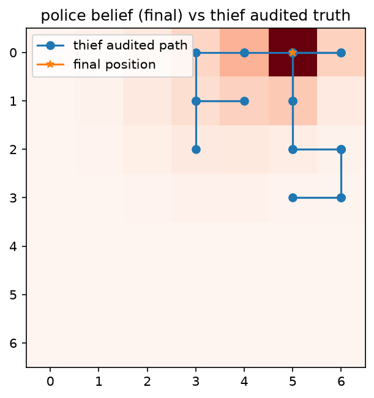
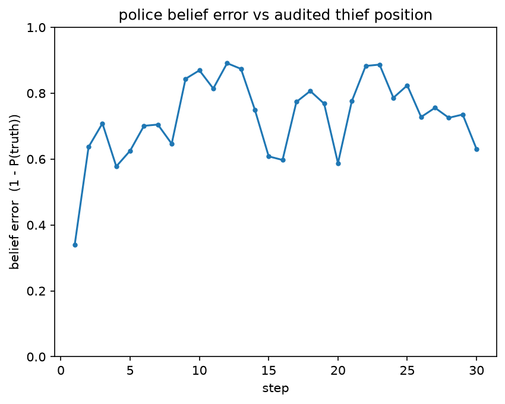

# M4 observability evidence — GUI, replay verdicts, overlay (2026-07-18)

> DoD observations for TODO **M4-2 / M4-3 / M4-4** (PRD_gui_replay §10), produced on the
> `feat/m4-overlay` chain tip (PRs #25–#28) with the workstream-L log schema live.
> Everything below is quoted from actual command output / captured from the actual
> windows — nothing aspirational.

## The real audited game behind everything

`uv run copthief run local-match --police-seed 11 --thief-seed 22 --log docs/evidence/m4-local-g1.jsonl`

```
{"outcome": "cop_capture", "steps": 30, "survival_threshold": 35,
 "game_uid": "186a5c22-04c6-93a2-860c-9804cdd23db2",
 "audit_ok_police_side": true, "audit_ok_thief_side": true, ..., "scores": [20, 5]}
```

A real mini-game over the symmetric loops, mutual audit OK both sides — its log
(`m4-local-g1.jsonl`, committed) carries the full v1.1 schema: inbound-verbatim
`agreement_received`/`turn_received`/`audit_received`, `transition`, `belief`,
`decision`.

## M4-2 — live GUI (screenshot from a real game)


`assets/m4-live-heatmap.png` — the police live window at step 12 of the game above:
green **YOUR TURN** banner (state machine in `computing_move`), belief heatmap
concentrating red where scent + hints point, own position `P`, and the actual
gazetteer hints that traveled ("...crowds near Grand Central...", "...All roads seem
to lead to Central Park."). Local truth only: the window renders exclusively from the
local event stream (App E rules 8–9 hold by construction; see PR #26 tests).

## M4-3 — replay verdicts (both observed)

| Input | Command output (verbatim) | Exit |
|---|---|---|
| the real M4 log | `{"verdict": "Verified OK", "problems": [], "steps": 30, "outcome": "cop_capture", ...}` | 0 |
| **mutated copy** (record 5 `move` → `"forged"`, committed as `m4-local-g1-TAMPERED-copy.jsonl`) | `{"verdict": "TAMPERED", "problems": ["thief step 5: record does not re-hash to its commit (tamper)"], ...}` | 1 |
| M2 evidence log `m2-stageA-g1-ourcop-vs-refthief.jsonl` (live vs the reference) | `{"verdict": "Verified OK", "problems": [], ...}` | 0 |
| M3 evidence log `m3-scent-friendly-g1.jsonl` (live vs the reference) | `{"verdict": "Verified OK", "problems": [], ...}` | 0 |

Viewer screenshots (App C artifacts): `assets/m4-replay-verified.png` (green banner,
step 15/30, both audited positions) · `assets/m4-replay-tampered.png` (red banner over
the mutated copy).


The rule-19 mutation matrix (every sealed field + nonce + commit → TAMPERED) runs as a
permanent CI regression (`tests/integration/test_replay_verdict.py`).

## M4-4 — belief-vs-truth overlay (rendered from the real audited game)

`uv run copthief overlay --log docs/evidence/m4-local-g1.jsonl --out assets/m4-belief-overlay.png --role police`




- `assets/m4-belief-overlay.png` — the thief's **revealed audit trajectory** drawn
  over the police's final belief heatmap; the belief mass sits on the thief's actual
  final cell (where the capture happened).
- `assets/m4-belief-overlay-curve.png` — per-step belief error (`1 − P(truth)`, the
  M3-3 metric identically) across all 30 steps.

## Honest notes

- The M2/M3 live logs verify **our side only** — they predate the v1.1 schema, so no
  inbound archives exist in them (that gap is exactly what workstream L closed; the
  new `m4-local-g1.jsonl` demonstrates both-sides verification from archived
  verbatim inbound). Old logs remain verifiable forever (compat pinned in CI).
- This game is a local match (both peers ours, real loops + real audits). A
  tunnel-friendly screenshot vs the reference can replace the App C shots later if
  wanted — network runs need Imree's word.
- Screenshots were captured programmatically from the real windows (DPI-aware
  window-rect grab); retake manually any time with
  `uv run copthief run local-match --gui` / `uv run copthief replay --log <log> --gui`.
